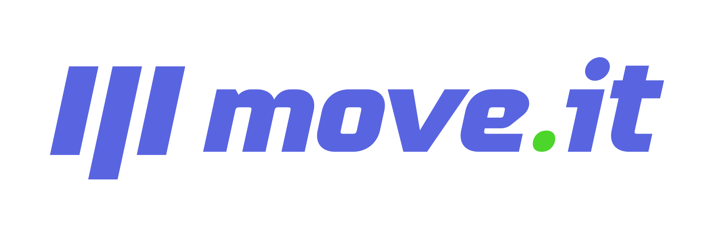

<p align="center">

  <a href="LICENSE" style="text-decoration: none">
    
  </a>

  <a href="https://github.com/wesleyfeitosa/moveit/issues" style="text-decoration: none">
    
  </a>

  <a href="#" style="text-decoration: none">
    
  </a>
  
  <a href="https://github.com/wesleyfeitosa/moveit/stargazers" style="text-decoration: none">
    
  </a>

</p>

## :rocket: Technologies

This project was developed with the following technologies:

- [React](https://reactjs.org)
- [Typescript](https://www.typescriptlang.org/)
- [NextJs](https://nextjs.org/)
- [Context API](https://pt-br.reactjs.org/docs/context.html)

## 💻 Project

Moveit is a time optimization project using the pomodoro technique to bring more productivity to users' daily lives.

<div style="position: relative; padding-bottom: 56.25%; height: 0;"><iframe src="https://www.loom.com/embed/f513e75a7315448d9d36db0df1fc0e56" frameborder="0" webkitallowfullscreen mozallowfullscreen allowfullscreen style="position: absolute; top: 0; left: 0; width: 100%; height: 100%;"></iframe></div>

## :hammer: Deploy

- Frontend/Web: https://moveit-next-lime.vercel.app/

## 🤔 How to contribute

- Fork this repository;
- Create a branch with your feature: `git checkout -b my-feature`;
- Commit your changes: `git commit -m 'feat: My new feature'`;
- Push to your branch: `git push origin my-feature`.

After the merge of your pull request is done, you can delete your branch.

## 🔖 How to run

#### Cloning the project
```sh
git clone https://github.com/wesleyfeitosa/moveit.git
cd moveit
```
#### Starting Frontend
```sh
cd moveit-next
yarn dev
open http://localhost:3000
```

## :memo: License

This project is under the MIT license. See the file [LICENSE](LICENSE) for more details.

## 🙏🏼 Acknowledgments

I want to thank [Rocketseat](https://github.com/Rocketseat) for devising and providing the basis for this project

---

Made with 💜 by Wesley Feitosa :wave: 